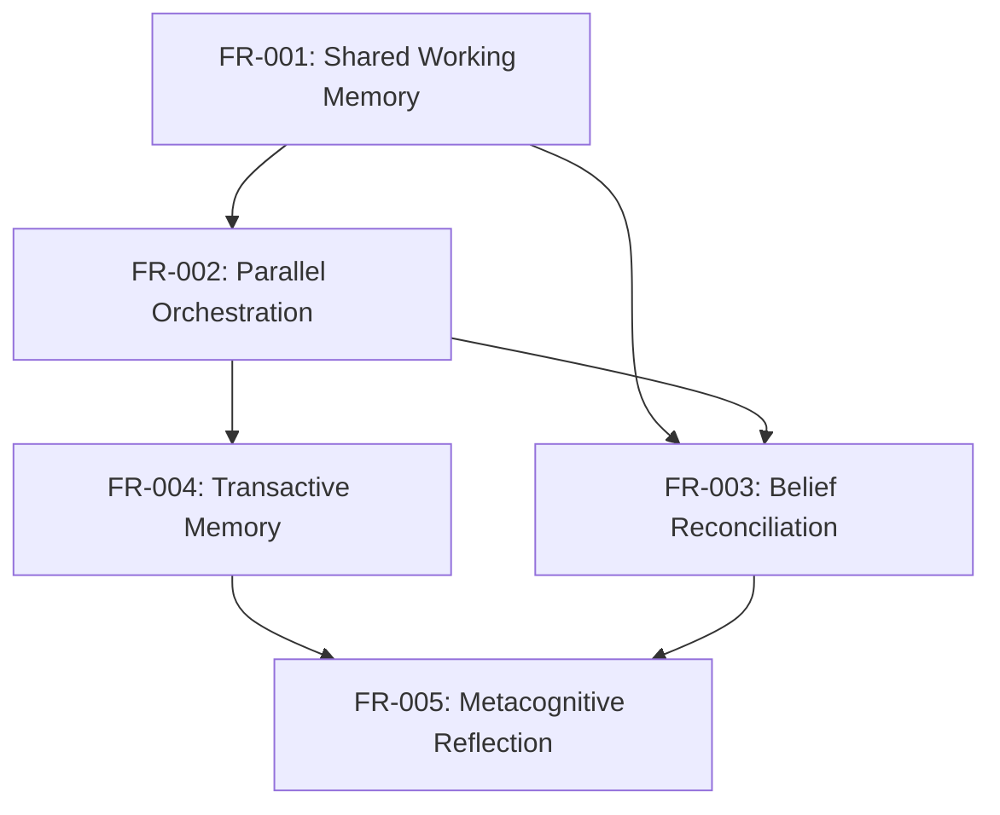

# Functional Requirements Index

**Project:** draagon-ai Cognitive Swarm Architecture
**Status:** Phase 2 Planning
**Last Updated:** 2025-12-30

---

## Overview

This directory contains functional requirement specifications for the Cognitive Swarm Architecture, derived from the comprehensive design document at `docs/specs/COGNITIVE_SWARM_ARCHITECTURE.md`.

Each FR document follows spec kit standards with:
- Clear acceptance criteria (testable)
- Constitution compliance checks
- Research grounding
- Implementation estimates
- Integration points

---

## Functional Requirements

### Phase 1: Foundation

| FR ID | Feature | Priority | Complexity | Estimate | Status |
|-------|---------|----------|------------|----------|--------|
| [FR-001](./FR-001-shared-cognitive-working-memory.md) | Shared Cognitive Working Memory | P0 | Medium | 10 days | Planned |
| [FR-002](./FR-002-parallel-multi-agent-orchestration.md) | Parallel Multi-Agent Orchestration | P0 | High | 15 days | Planned |
| [FR-003](./FR-003-multi-agent-belief-reconciliation.md) | Multi-Agent Belief Reconciliation | P0 | High | 13 days | Planned |

### Phase 2: Enhancement

| FR ID | Feature | Priority | Complexity | Estimate | Status |
|-------|---------|----------|------------|----------|--------|
| [FR-004](./FR-004-transactive-memory-system.md) | Transactive Memory System | P1 | Medium | 10 days | Planned |
| [FR-005](./FR-005-metacognitive-reflection-service.md) | Metacognitive Reflection Service | P1 | Medium | 11 days | Planned |

---

## Dependencies



**Critical Path:** FR-001 → FR-002 → FR-003 (38 days)
**Total Sequential:** 59 days
**Parallelizable After FR-001:** FR-004 and FR-005 can start after FR-002 completes

---

## Implementation Phases

### Phase 1: Shared Memory Foundation (Weeks 1-2)
- **FR-001**: Shared Cognitive Working Memory
- **Deliverable**: SharedWorkingMemory class with tests
- **Success Criteria**: Handles 10 concurrent agents, Miller's Law capacity

### Phase 2: Parallel Execution (Weeks 3-4)
- **FR-002**: Parallel Multi-Agent Orchestration
- **Deliverable**: ParallelCognitiveOrchestrator with 3 sync modes
- **Success Criteria**: 2.5x speedup vs sequential, handles timeouts gracefully

### Phase 3: Conflict Resolution (Weeks 5-6)
- **FR-003**: Multi-Agent Belief Reconciliation
- **Deliverable**: MultiAgentBeliefReconciliation with LLM-based analysis
- **Success Criteria**: >90% conflict resolution rate, audit trail

### Phase 4: Expertise Routing (Weeks 7-8)
- **FR-004**: Transactive Memory System
- **Deliverable**: TransactiveMemory with query routing
- **Success Criteria**: 85% routing accuracy, novel benchmark passes

### Phase 5: Self-Improvement (Weeks 9-10)
- **FR-005**: Metacognitive Reflection Service
- **Deliverable**: MetacognitiveReflectionService with pattern learning
- **Success Criteria**: 80% tasks produce actionable insights

---

## Constitution Compliance Summary

All FRs validated against draagon-ai constitution:

| Principle | FR-001 | FR-002 | FR-003 | FR-004 | FR-005 |
|-----------|--------|--------|--------|--------|--------|
| LLM-First Architecture | ✅ | ✅ | ✅ | ✅ | ✅ |
| XML Output Format | N/A | N/A | ✅ | N/A | ✅ |
| Protocol-Based Design | ✅ | ✅ | ✅ | ✅ | ✅ |
| Async-First Processing | ✅ | ✅ | ✅ | ✅ | ✅ |
| Research-Grounded | ✅ | ✅ | ✅ | ✅ | ✅ |
| Cognitive Authenticity | ✅ | ✅ | ✅ | ✅ | ✅ |
| Test Outcomes | ✅ | ✅ | ✅ | ✅ | ✅ |

**Result:** 100% constitution compliance across all requirements.

---

## Research Foundation

Each FR is grounded in peer-reviewed research:

### Memory & Cognition
- **Miller's Law (1956)**: Working memory capacity (FR-001)
- **Baddeley's Working Memory Model**: Attention weighting (FR-001)
- **Wegner (1987)**: Transactive memory theory (FR-004)
- **ICML 2025**: Metacognitive learning (FR-005)

### Multi-Agent Systems
- **Anthropic Multi-Agent Research**: 3-5 agents optimal (FR-002)
- **MAST Framework (2025)**: Inter-agent misalignment taxonomy (FR-002, FR-003)
- **MultiAgentBench (ACL 2025)**: Coordination failures (FR-002, FR-004)
- **MemoryAgentBench**: Conflict resolution benchmark (FR-003)

### Epistemic Logic
- **BDI Agent Architectures**: Belief-Desire-Intention (FR-003)
- **Intrinsic Memory Agents**: Heterogeneous memory (FR-001)

---

## Benchmark Targets

Requirements designed to beat current SOTA:

| Benchmark | Current SOTA | Our Target | Primary FR |
|-----------|-------------|------------|------------|
| MultiAgentBench Werewolf | 36.33% | 55%+ | FR-003 |
| MultiAgentBench Research | 84.13% | 90%+ | FR-004 |
| MemoryAgentBench Conflict | ~45% | 70%+ | FR-003 |
| MemoryAgentBench Consolidation | ~50% | 75%+ | FR-003 |
| GAIA Level 3 | ~40% | 55%+ | FR-001 |
| HI-TOM 3rd Order | ~40% | 60%+ | FR-003 |

**Novel Benchmarks to Create:**
- Transactive Memory Routing (FR-004)
- Metacognitive Improvement (FR-005)
- Cognitive Swarm Coordination (FR-001 + FR-002)

---

## Integration Architecture

```
┌─────────────────────────────────────────────────────────┐
│              Application Layer                          │
│  (Roxy, custom assistants)                              │
└────────────────────┬────────────────────────────────────┘
                     │
┌────────────────────▼────────────────────────────────────┐
│         FR-002: ParallelCognitiveOrchestrator           │
│  ┌──────────────────────────────────────────────────┐   │
│  │  FR-001: SharedWorkingMemory                     │   │
│  └──────────────────────────────────────────────────┘   │
│  ┌──────────────────────────────────────────────────┐   │
│  │  FR-004: TransactiveMemory (routing)             │   │
│  └──────────────────────────────────────────────────┘   │
└────────────────────┬────────────────────────────────────┘
                     │
         ┌───────────┼───────────┐
         │           │           │
┌────────▼──────┐ ┌──▼────────┐ ┌▼─────────────────────┐
│  FR-003:      │ │ Agent     │ │  FR-005:             │
│  Belief       │ │ Execution │ │  Metacognitive       │
│  Reconcile    │ │           │ │  Reflection          │
└───────────────┘ └───────────┘ └──────────────────────┘
                                          │
                     ┌────────────────────┘
                     │
         ┌───────────▼───────────┐
         │  Learning Service     │
         │  (Semantic Memory)    │
         └───────────────────────┘
```

---

## Next Steps

1. **Review & Approval**: Review all FR documents for completeness
2. **Planning Phase**: Create detailed implementation plans using `/plan` command
3. **Task Breakdown**: Use `/tasks` command to create granular task list
4. **Implementation**: Execute via `/implement` command with test-driven approach
5. **Benchmarking**: Run against MultiAgentBench, MemoryAgentBench, create novel benchmarks

---

## Open Questions

Global questions affecting multiple FRs:

1. **Embedding Provider**: Use OpenAI embeddings, local model (sentence-transformers), or defer to Phase 2?
   - **Recommendation**: Start with placeholder, add embeddings in Phase 2 (after core logic validated)

2. **Persistence Layer**: Should SharedWorkingMemory persist across restarts for long-running tasks?
   - **Recommendation**: In-memory for Phase 1, persistence in Phase 2 if benchmarks show need

3. **Configuration Management**: How to apply MetacognitiveReflection suggestions?
   - **Recommendation**: Manual review for Phase 1, auto-tuning in Phase 2

---

**Document Status:** Active
**Maintainer:** draagon-ai team
**Last Review:** 2025-12-30
